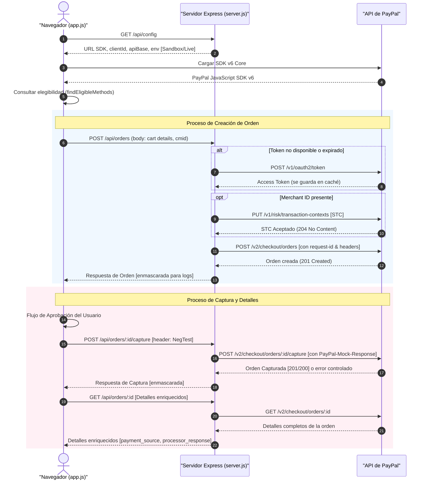

# 💳 PayPal JSv6 Checkout + BCDC Server-Side Demo

[](https://nodejs.org/)
[](https://expressjs.com/)
[](https://developer.paypal.com/)
[](#)

Un demo técnico avanzado e interactivo para checkout web que integra **PayPal JavaScript SDK v6**, **PayPal Checkout Standard (Smart Buttons)**, **PayLater**, **PayPal Credit** y **Branded Card-Direct Checkout (BCDC)** mediante una arquitectura de servidor tipo **BFF (Backend-For-Frontend)**.

El objetivo principal de este proyecto es demostrar cómo desacoplar de manera segura la lógica del cliente y la del servidor, garantizando que el `client_secret` de PayPal permanezca oculto en el servidor y nunca se exponga al navegador, mientras se expone una interfaz rica y reactiva para el control del flujo del checkout.

---

## 🏗️ Arquitectura de la Solución (Flujo E2E)

El siguiente diagrama ilustra la orquestación entre el navegador web, el servidor BFF local y las APIs REST de PayPal:



---

## 📂 Estructura del Proyecto

```text
.
├── server.js                     # Servidor Express (BFF & Proxy REST PayPal)
├── app.js                        # Lógica del frontend y orquestación del SDK v6
├── index.html                    # Interfaz de usuario interactiva (UI)
├── styles.css                    # Estilos CSS modernos y responsivos
├── package.json                  # Scripts y dependencias de Node.js
├── package-lock.json
├── .env.example                  # Plantilla de variables de entorno
├── .gitignore
├── README.md                     # Esta guía del desarrollador
└── docs_and_skill/
    ├── SDD_JSV6_ES.md            # Solution Design Document (Español)
    ├── SDD_JSV6_ES.pdf           # Solution Design Document PDF (Español)
    ├── SDD_JSV6_EN.md            # Solution Design Document (Inglés)
    ├── SDD_JSV6_EN.pdf           # Solution Design Document PDF (Inglés)
    └── jsv6-bcdc-integration.skill # Definición de skill para agentes AI
```

---

## 🛠️ Requisitos del Entorno

* **Node.js**: Versión `18` o superior (se utiliza `fetch` nativo para llamadas HTTP).
* **Credenciales de PayPal** (Sandbox para pruebas, y opcionalmente Live):
  * `client_id` (Identificador público)
  * `client_secret` (Clave privada)
  * `merchant_id` (Opcional, necesario para el flujo de atribución STC y multi-vendedor)

---

## 🚀 Instalación y Ejecución

### 1. Clonar e Instalar Dependencias
Instala los paquetes necesarios definidos en `package.json` (`express` y `dotenv`):
```bash
npm install
```

### 2. Configuración de Credenciales
El servidor busca un archivo `.env` en la raíz del proyecto. Si no lo encuentra en el primer arranque, **creará uno automáticamente** con credenciales Sandbox públicas preconfiguradas para que puedas probar el demo inmediatamente.

Para configurarlo manualmente, copia el archivo `.env.example` a un nuevo archivo `.env` e ingresa tus valores:
```env
# PayPal Sandbox Credentials
SANDBOX_CLIENT_ID=your_sandbox_client_id_here
SANDBOX_CLIENT_SECRET=your_sandbox_client_secret_here
SANDBOX_MERCHANT_ID=your_sandbox_merchant_id_here

# PayPal Live Credentials
LIVE_CLIENT_ID=your_live_client_id_here
LIVE_CLIENT_SECRET=your_live_client_secret_here
LIVE_MERCHANT_ID=your_live_merchant_id_here
```

### 3. Levantar el Servidor

* **Producción o Inicio Estándar**:
  ```bash
  npm start
  ```
* **Modo Desarrollo** (Con recarga automática en cambios usando `--watch` de Node.js):
  ```bash
  npm run dev
  ```

El demo estará disponible inmediatamente en tu navegador:
👉 **[http://localhost:8080](http://localhost:8080)**

> [!TIP]
> Puedes cambiar el puerto por defecto estableciendo la variable de entorno `PORT`:
> * **Linux / macOS (Bash)**: `PORT=3000 npm start`
> * **Windows (PowerShell)**: `$env:PORT = 3000; npm start`

---

## ⚙️ Controles e Interacción en la UI

La interfaz incluye un panel de control interactivo en la parte superior izquierda que permite alterar dinámicamente el comportamiento de la integración sin modificar código:

| Control | Descripción | Acción e Impacto |
| :--- | :--- | :--- |
| **ENV** | Selector de Entorno | Alterna entre **Sandbox** y **Live**. Se guarda en `localStorage` y reinicia el SDK. |
| **Neg Test** | Pruebas Negativas | Inyecta respuestas simuladas de error (`INSTRUMENT_DECLINED`, `TRANSACTION_REFUSED`) en el Capture. |
| **Currency** | Moneda de Pago | Alterna la moneda de la orden entre **MXN** y **USD**. |
| **AMT** | Monto de la Orden | Define el valor total del carrito de compras simulado. |
| **CREDS** | Administrador de Credenciales | Abre un modal para ver, ingresar y modificar las claves del archivo `.env` en caliente. |
| **Reset** | Reinicio Completo | Limpia el estado de la UI, recarga la configuración del SDK y reinicia los botones de pago. |

---

## 🧪 Pruebas Negativas (Negative Testing)

El selector **Neg Test** permite simular fallos comunes en las APIs de PayPal durante la fase de captura (`Capture`), lo cual es indispensable para probar flujos de recuperación en el frontend (como declinaciones de emisor o fallas de riesgo).

Al activar un valor, el BFF añade el encabezado `PayPal-Mock-Response` en la llamada a PayPal:

| Opción Seleccionada | Encabezado Mock Enviado | Simulación / Comportamiento esperado |
| :--- | :--- | :--- |
| **`NO`** | *(Ninguno)* | Procesamiento de flujo real normal. |
| **`Issuer`** | `{"mock_application_codes":"INSTRUMENT_DECLINED"}` | Simula tarjeta rechazada por el banco emisor. Permite probar la recuperación automática de BCDC. |
| **`Risk`** | `{"mock_application_codes":"TRANSACTION_REFUSED"}` | Simula transacción rechazada por el motor de riesgo de PayPal. |

---

## 🔌 Catálogo de Endpoints Locales (BFF API)

El servidor Express expone una API limpia para desacoplar las interacciones del frontend con la API REST de PayPal:

| Método | Endpoint | Descripción | Payload / Comportamiento |
| :--- | :--- | :--- | :--- |
| **`GET`** | `/api/config` | Configuración del SDK | Retorna variables públicas (`clientId`, `apiBase`, `sdkUrl`) según el entorno seleccionado. |
| **`GET`** | `/api/credentials` | Lectura de credenciales | Obtiene los datos del archivo `.env` (excluyendo o enmascarando parcialmente en producción, expuesto en demo). |
| **`POST`** | `/api/credentials` | Escritura de credenciales | Guarda nuevas credenciales en `.env`, borra la caché OAuth en memoria y fuerza la recarga del SDK en el browser. |
| **`POST`** | `/api/oauth/token` | Refresco de token OAuth | Solicita manualmente un access token a PayPal para fines de diagnóstico. |
| **`POST`** | `/api/orders` | Creación de orden | Genera una orden de compra en PayPal. Si hay `merchant_id` configurado, envía automáticamente STC. |
| **`GET`** | `/api/orders/:id` | Consulta de orden | Consulta el estado detallado de una orden. Retorna campos enriquecidos de la fuente de pago. |
| **`POST`** | `/api/orders/:id/capture` | Captura de orden | Realiza el cobro final de la orden. Soporta simulación mediante headers de pruebas negativas. |
| **`PUT`** | `/api/stc` | Envío manual de STC | Permite enviar el Sender Transaction Context de forma explita fuera del flujo de creación de orden. |

### 📝 Estructura de Respuesta del Proxy
Las respuestas de operaciones REST (`POST /api/orders`, `POST /api/orders/:id/capture`, etc.) tienen un formato estandarizado que incluye trazas de diagnóstico simplificadas:

```json
{
  "oauthLog": null,
  "stcLog": null,
  "log": {
    "method": "POST",
    "endpoint": "https://api-m.sandbox.paypal.com/v2/checkout/orders",
    "status": 201,
    "request": { ... },
    "response": { ... }
  },
  "data": { ... }
}
```
* **`oauthLog`**: Contiene la traza de la llamada de autenticación en caso de que el token haya expirado o no existiera en caché.
* **`stcLog`**: Contiene la traza de la llamada a `PUT /v1/risk/transaction-contexts` al enviar datos de prevención de fraude.

---

## 🔒 Seguridad y Enmascaramiento de Datos

> [!IMPORTANT]
> Para fines didácticos, el panel de logs de la interfaz de usuario muestra el flujo completo de Request y Response de cada llamada HTTP. Sin embargo, para cumplir con mejores prácticas de seguridad, el servidor aplica un enmascaramiento estricto sobre datos sensibles antes de transmitirlos al navegador.

### Lógica de Enmascaramiento
Cualquier campo que coincida con las siguientes claves sensibles conserva únicamente sus **primeros 5 caracteres** y reemplaza todo lo restante por asteriscos (`*`), preservando la longitud y formato general:
* `access_token`, `refresh_token`, `id_token`
* `client_secret`, `clientSecret`
* `Authorization` (el prefijo `Basic ` o `Bearer ` se conserva legible, y solo se enmascara el token base64/JWT)
* `nonce`
* `app_id`, `appId`

---

## 💡 Detalles Técnicos de Implementación

1. **Prevención de Cache Estático**: `server.js` deshabilita el cache HTTP para archivos estáticos (`index.html`, `app.js`, `styles.css`) con encabezados `Cache-Control: no-store`. Esto evita problemas de refresco de interfaz en entornos de desarrollo local.
2. **Caché Eficiente de Access Tokens**: Los tokens de acceso se almacenan en la memoria del servidor por entorno (`sandbox` y `live`), autolimpiándose antes de su tiempo de expiración (generalmente 9 horas).
3. **Generación Robustecida de IDs**:
   * **`PayPal-Request-Id`**: Se regenera de forma independiente en cada solicitud de creación y captura de orden para evitar colisiones e idempotencia accidental en reintentos legítimos.
   * **`cmid`**: El identificador de cliente en riesgo/STC se genera dinámicamente en el browser y se valida del lado del servidor para garantizar que no exceda el límite de 32 caracteres alfanuméricos impuesto por PayPal.
4. **Fallback SPA**: Cualquier petición no capturada por las rutas API (`GET *`) devuelve `index.html`. Esto permite implementar ruteo del lado del cliente en el frontend con fluidez.

---

## 📚 Documentación Avanzada Incluida

En la carpeta [`docs_and_skill/`](file:///c:/Users/migue/OneDrive/Desktop/Proyectos/JSV6%20CHECKOUT%20BCDC/docs_and_skill/) encontrarás la documentación de diseño oficial de la solución:
* **Español**: [SDD_JSV6_ES.md](file:///c:/Users/migue/OneDrive/Desktop/Proyectos/JSV6%20CHECKOUT%20BCDC/docs_and_skill/SDD_JSV6_ES.md) (y su versión [PDF](file:///c:/Users/migue/OneDrive/Desktop/Proyectos/JSV6%20CHECKOUT%20BCDC/docs_and_skill/SDD_JSV6_ES.pdf)).
* **Inglés**: [SDD_JSV6_EN.md](file:///c:/Users/migue/OneDrive/Desktop/Proyectos/JSV6%20CHECKOUT%20BCDC/docs_and_skill/SDD_JSV6_EN.md) (y su versión [PDF](file:///c:/Users/migue/OneDrive/Desktop/Proyectos/JSV6%20CHECKOUT%20BCDC/docs_and_skill/SDD_JSV6_EN.pdf)).
* **Skill de IA**: El archivo [jsv6-bcdc-integration.skill](file:///c:/Users/migue/OneDrive/Desktop/Proyectos/JSV6%20CHECKOUT%20BCDC/docs_and_skill/jsv6-bcdc-integration.skill) permite a agentes inteligentes de desarrollo como Antigravity entender y extender el demo con precisión quirúrgica.

---

## ⚠️ Consideraciones Críticas para Producción

Este proyecto es un demo técnico de referencia. Antes de desplegarlo en un entorno productivo real, debes implementar las siguientes mejoras de seguridad y arquitectura:

1. **Eliminar o Proteger endpoints de credenciales**: Las rutas `/api/credentials` (tanto `GET` como `POST`) no deben estar expuestas públicamente. En producción, las variables de entorno deben definirse a nivel sistema o mediante un proveedor de gestión de secretos (como AWS Secrets Manager, Vault, etc.).
2. **Autenticación y CORS**: Restringe los orígenes permitidos en las llamadas al servidor (CORS) y asegura que todas las llamadas de checkout requieran una sesión activa de usuario.
3. **Protección CSRF**: Implementa tokens Anti-CSRF en peticiones de mutación del checkout (`POST /api/orders`).
4. **HTTPS Obligatorio**: PayPal requiere comunicación segura SSL/TLS (HTTPS) para el funcionamiento correcto del SDK en entornos productivos.
5. **Datos del Comprador Reales**: Reemplaza los datos mockeados del pagador, dirección de envío y montos del carrito definidos en `server.js` y `app.js` por las variables reales de tu plataforma de e-commerce.
