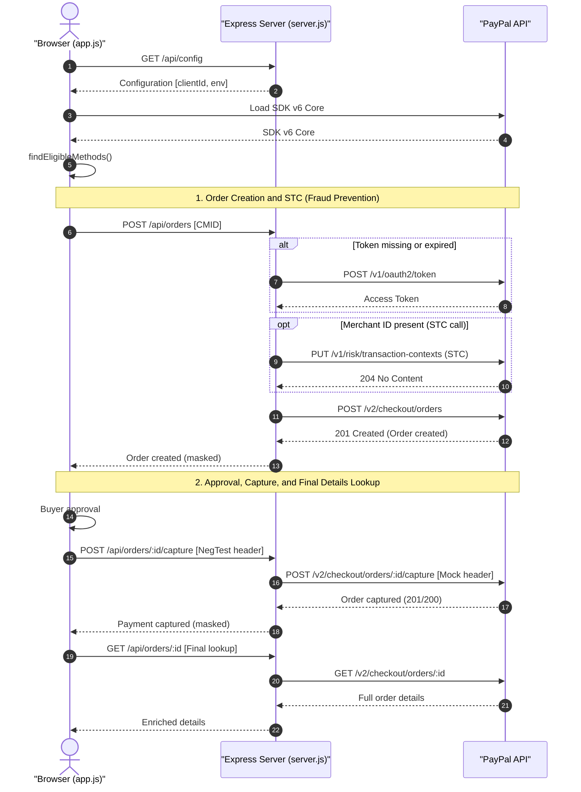

# PayPal JSv6 Checkout + BCDC Server-Side Demo

[](https://nodejs.org/)
[](https://expressjs.com/)
[](https://developer.paypal.com/)

An advanced, interactive technical demo for web checkout that integrates **PayPal JavaScript SDK v6**, **PayPal Checkout Standard (Smart Buttons)**, **PayLater**, **PayPal Credit**, and **Branded Card-Direct Checkout (BCDC)** through a server-side **BFF (Backend-for-Frontend)** architecture.

The main goal of this project is to demonstrate how to safely separate client-side and server-side responsibilities, keeping the PayPal `client_secret` hidden on the server and never exposing it to the browser, while still providing a rich interactive checkout control surface.

---

## Solution Architecture (End-to-End Flow)

The following diagram shows the orchestration between the browser, the local BFF server, and PayPal REST APIs. Static colored backgrounds were intentionally avoided so the diagram keeps good contrast in both light and dark GitHub themes.



---

## Project Structure

```text
.
|-- server.js                       # Express server (BFF and PayPal REST proxy)
|-- app.js                          # Frontend logic and SDK v6 orchestration
|-- index.html                      # Interactive checkout UI
|-- styles.css                      # Responsive CSS styles
|-- package.json                    # Node.js scripts and dependencies
|-- package-lock.json
|-- .env.example                    # Environment variable template
|-- .gitignore
|-- README.md                       # This developer guide
`-- docs_and_skill/
    |-- SDD_JSV6_ES.md              # Solution Design Document (Spanish)
    |-- SDD_JSV6_ES.pdf             # Solution Design Document PDF (Spanish)
    |-- SDD_JSV6_EN.md              # Solution Design Document (English)
    |-- SDD_JSV6_EN.pdf             # Solution Design Document PDF (English)
    `-- jsv6-bcdc-integration.skill # AI agent skill definition
```

---

## Environment Requirements

- **Node.js**: version `18` or higher. The server uses native `fetch` for HTTP calls.
- **PayPal credentials** for Sandbox testing and, optionally, Live:
  - `client_id` (public identifier)
  - `client_secret` (private secret)
  - `merchant_id` (optional, required for STC attribution and multi-seller flows)

---

## Installation and Running Locally

The project is designed to provide a zero-configuration first run.

### 1. Install Dependencies

Install the packages defined in `package.json` (`express` and `dotenv`):

```bash
npm install
```

### 2. Start the Server

Development mode, with automatic restart on changes via Node.js `--watch`:

```bash
npm run dev
```

Standard startup:

```bash
npm start
```

The demo will be available at:

[http://localhost:8080](http://localhost:8080)

> [!TIP]
> You can change the default port with the `PORT` environment variable:
>
> - **Linux / macOS (Bash)**: `PORT=3000 npm start`
> - **Windows (PowerShell)**: `$env:PORT = 3000; npm start`

---

## Dynamic Credential Management

> [!IMPORTANT]
> You do not need to configure files manually for the first run.
>
> 1. **Automatic `.env` generation**: when the server starts for the first time, it detects that `.env` is missing and creates it automatically with preconfigured public Sandbox demo credentials, so you can test the checkout flow immediately.
> 2. **Credential Manager UI**: to use your own Sandbox or Live credentials, click the **CREDS** button in the UI control panel. The modal lets you view, edit, and save keys directly to `.env` while the server is running, without opening a text editor or restarting the server.

---

## UI Controls and Interaction

The UI includes an interactive control panel in the top-left area. It lets you change integration behavior dynamically without editing code.

| Control | Description | Action and Impact |
| :--- | :--- | :--- |
| **ENV** | Environment selector | Switches between **Sandbox** and **Live**. The value is stored in `localStorage` and the SDK is reset. |
| **Neg Test** | Negative testing | Injects simulated error responses (`INSTRUMENT_DECLINED`, `TRANSACTION_REFUSED`) during capture. |
| **Currency** | Payment currency | Switches the order currency between **MXN** and **USD**. |
| **AMT** | Order amount | Defines the total value of the simulated shopping cart. |
| **CREDS** | Credential manager | Opens a modal to view, enter, and update `.env` credentials while the app is running. |
| **Reset** | Full reset | Clears UI state, reloads SDK configuration, and reinitializes the payment buttons. |

---

## Negative Testing

The **Neg Test** selector simulates common PayPal API failures during the capture phase. This is useful for testing frontend recovery flows such as issuer declines or risk refusals.

When a value is selected, the BFF adds the `PayPal-Mock-Response` header to the PayPal capture call:

| Selected Option | Mock Header Sent | Expected Simulation / Behavior |
| :--- | :--- | :--- |
| **`NO`** | *(None)* | Normal real-flow processing. |
| **`Issuer`** | `{"mock_application_codes":"INSTRUMENT_DECLINED"}` | Simulates a card declined by the issuing bank. Useful for testing BCDC recovery. |
| **`Risk`** | `{"mock_application_codes":"TRANSACTION_REFUSED"}` | Simulates a transaction refused by PayPal's risk engine. |

---

## Local Endpoint Catalog (BFF API)

The Express server exposes a clean API that decouples frontend interactions from the PayPal REST API:

| Method | Endpoint | Description | Payload / Behavior |
| :--- | :--- | :--- | :--- |
| **`GET`** | `/api/config` | SDK configuration | Returns public variables (`clientId`, `apiBase`, `sdkUrl`) for the selected environment. |
| **`GET`** | `/api/credentials` | Credential read | Reads values from `.env`. This is exposed only for demo convenience. |
| **`POST`** | `/api/credentials` | Credential write | Saves new credentials to `.env`, clears the in-memory OAuth cache, and forces the browser SDK configuration to reload. |
| **`POST`** | `/api/oauth/token` | OAuth token refresh | Manually requests an access token from PayPal for diagnostics. |
| **`POST`** | `/api/orders` | Order creation | Creates a PayPal order. If `merchant_id` is configured, the server automatically sends STC. |
| **`GET`** | `/api/orders/:id` | Order lookup | Fetches detailed order state and enriched payment-source fields. |
| **`POST`** | `/api/orders/:id/capture` | Order capture | Performs the final charge. Supports negative-testing simulation headers. |
| **`PUT`** | `/api/stc` | Manual STC send | Sends Sender Transaction Context explicitly outside the order creation flow. |

### Proxy Response Shape

REST operation responses (`POST /api/orders`, `POST /api/orders/:id/capture`, and similar endpoints) use a standardized shape with simplified diagnostic traces:

```json
{
  "oauthLog": null,
  "stcLog": null,
  "log": {
    "method": "POST",
    "endpoint": "https://api-m.sandbox.paypal.com/v2/checkout/orders",
    "status": 201,
    "request": { "...": "..." },
    "response": { "...": "..." }
  },
  "data": { "...": "..." }
}
```

- **`oauthLog`**: contains the authentication call trace when the token was missing or expired.
- **`stcLog`**: contains the `PUT /v1/risk/transaction-contexts` trace when fraud-prevention data is sent.

---

## Security and Data Masking

> [!IMPORTANT]
> For learning and diagnostics, the UI log panel shows the request and response flow for each HTTP call. However, the server applies strict masking to sensitive data before sending logs to the browser.

### Masking Logic

Any field matching the following sensitive keys keeps only its **first 5 characters** and replaces the rest with asterisks (`*`), preserving the general length and shape:

- `access_token`, `refresh_token`, `id_token`
- `client_secret`, `clientSecret`
- `Authorization` (the `Basic ` or `Bearer ` prefix remains readable; only the base64/JWT credential is masked)
- `nonce`
- `app_id`, `appId`

---

## Technical Implementation Details

1. **Static cache prevention**: `server.js` disables HTTP caching for static files (`index.html`, `app.js`, `styles.css`) using `Cache-Control: no-store`. This avoids stale UI issues during local development.
2. **Efficient access-token cache**: access tokens are stored in server memory per environment (`sandbox` and `live`) and refreshed shortly before expiration.
3. **Robust ID generation**:
   - **`PayPal-Request-Id`**: generated independently for each order create and capture request to avoid collisions and accidental idempotency during legitimate retries.
   - **`cmid`**: the risk/STC client metadata ID is generated dynamically in the browser and validated server-side to ensure it stays within PayPal's 32-character alphanumeric limit.
4. **SPA fallback**: any non-API request (`GET *`) returns `index.html`, allowing smooth client-side routing if the frontend is extended later.

---

## Included Advanced Documentation

The [`docs_and_skill/`](docs_and_skill/) folder contains the official solution design documentation:

- **Spanish**: [SDD_JSV6_ES.md](docs_and_skill/SDD_JSV6_ES.md) and its [PDF version](docs_and_skill/SDD_JSV6_ES.pdf).
- **English**: [SDD_JSV6_EN.md](docs_and_skill/SDD_JSV6_EN.md) and its [PDF version](docs_and_skill/SDD_JSV6_EN.pdf).
- **AI skill**: [jsv6-bcdc-integration.skill](docs_and_skill/jsv6-bcdc-integration.skill) lets AI development agents understand and extend the demo with high precision.

---

## Critical Production Considerations

This project is a reference technical demo. Before deploying it to a real production environment, implement at least the following security and architecture improvements:

1. **Remove or protect credential endpoints**: `/api/credentials` (`GET` and `POST`) must not be publicly exposed. In production, environment variables should be defined at the platform level or through a secrets manager such as AWS Secrets Manager, Vault, or equivalent tooling.
2. **Authentication and CORS**: restrict allowed origins for server calls and ensure checkout calls require an active user session.
3. **CSRF protection**: implement anti-CSRF tokens for checkout mutation requests such as `POST /api/orders`.
4. **Mandatory HTTPS**: PayPal requires secure SSL/TLS communication (HTTPS) for correct SDK behavior in production environments.
5. **Real buyer data**: replace mocked payer, shipping-address, and cart-amount data in `server.js` and `app.js` with real values from your e-commerce platform.
